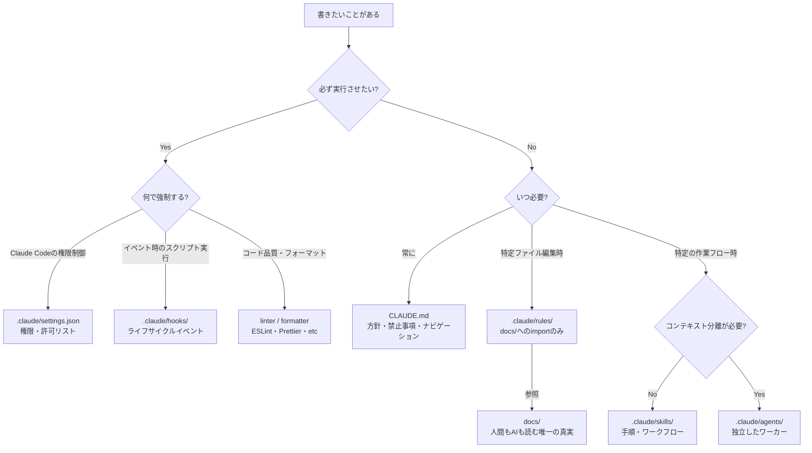
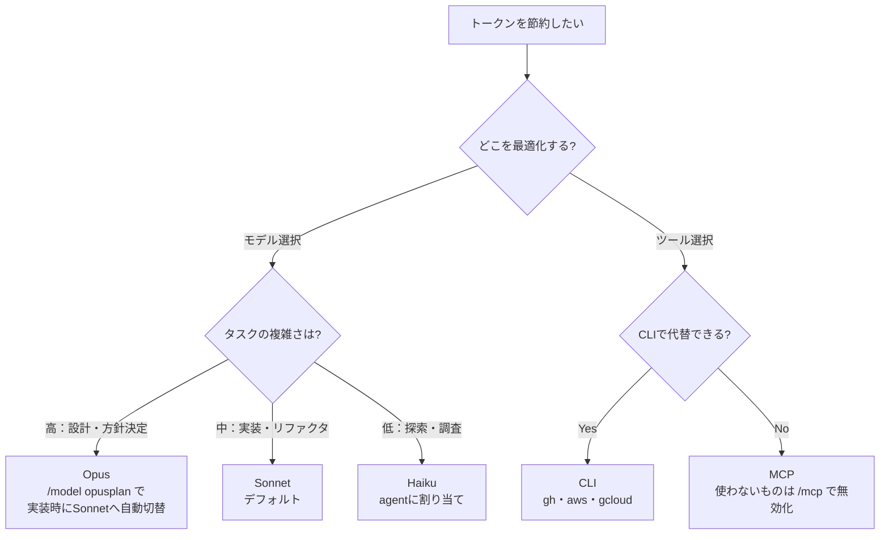
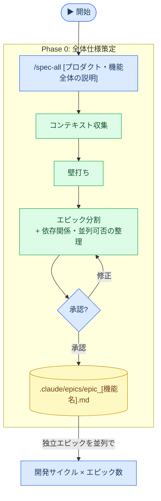

# AI協業設計ガイド

Claude Codeの設定設計における原則と構成パターン。複数プロジェクトで共通して参照できる汎用ナレッジ。

---

## 設計原則

1. **コンテキストウィンドウが唯一の制約** — CLAUDE.mdは長いほど守られなくなる（目安200行以内）
2. **具体性が信頼性を決める** — 検証可能な形で書けないルールは書かない
3. **強制と指針を分ける** — 必ず守らせたいことはhooks/settingsへ。CLAUDE.mdは保証されない
4. **遅延ロードで設計する** — 常に必要なものだけ起動時に読み込む
5. **構造がコンテンツと同じくらい重要** — 長くなったらまず削る

---

## 何をどこに書くか

---

## モデルとトークンの最適化

---

## docs/ が唯一の知識の置き場

CLAUDE.md・skills・agents・rules など Claude の設定ファイルにドメイン知識・判断基準を直接書かない。docs/ に書き、設定ファイルからはパスで参照する。

---

## アンチパターン

- **手順をCLAUDE.mdに書く** → skillsへ
- **docs/の内容をrulesにコピーする** → importだけにする
- **何でもCLAUDE.mdに書く** → 長くなるほど重要なルールが無視される
- **検証できないルールを書く** → 「良いコードを書く」は機能しない
- **ドメイン知識をClaude設定ファイルに書く** → docs/に書きそこから参照する（二重管理を避ける）

---

---

## 開発サイクル

### 並列開発サイクル（任意）

複数エピックを並列で進める場合は、開発サイクルの前に Phase 0 を実施する。

### 開発サイクル

```mermaid
flowchart TD
    classDef ai fill:#dcfce7,stroke:#16a34a,color:#14532d
    classDef human fill:#dbeafe,stroke:#2563eb,color:#1e3a5f
    classDef artifact fill:#fef9c3,stroke:#ca8a04,color:#713f12

    Start(["▶ 開始"]):::human
    NeedSpec{"仕様策定が必要?"}:::human
    Start --> NeedSpec

    subgraph Spec["Phase 1: 仕様策定（任意）"]
        SpecInvoke["/spec [機能の説明 or .claude/epics/epic_〇〇.md]"]:::human
        SpecCtx["Step1: コンテキストの収集"]:::ai
        SpecDiscuss["Step2: 壁打ち"]:::ai
        SpecStories["Step3: ストーリー分割"]:::ai
        SpecSave["Step4: 仕様書の作成"]:::ai
        SpecReview["Step5: 仕様レビュー・修正"]:::ai
        SpecApprove{"Step6: 承認?"}:::human
        SpecDoc[(".claude/temp/specs/機能名.md")]:::artifact
        SpecInvoke --> SpecCtx --> SpecDiscuss --> SpecStories --> SpecSave --> SpecReview --> SpecApprove
        SpecApprove -- 修正 --> SpecSave
        SpecApprove -- 承認 --> SpecDoc
    end

    subgraph Design["Phase 1.5: 詳細設計（任意）"]
        DesignInvoke["/design [設計対象の説明 or .claude/temp/specs/機能名.md]"]:::ai
        DesignCtx["Step1: コンテキストの収集"]:::ai
        DesignCreate["Step2: 技術設計"]:::ai
        DesignReview["Step3: 設計レビュー・修正"]:::ai
        DesignApprove{"Step4: 承認?"}:::human
        DesignDoc[(".claude/temp/designs/機能名.md")]:::artifact
        DesignInvoke --> DesignCtx --> DesignCreate --> DesignReview --> DesignApprove
        DesignApprove -- 修正 --> DesignCreate
        DesignApprove -- 承認 --> DesignDoc
    end

    subgraph Build["Phase 2: 実装"]
        BuildInvoke["/build [機能・ストーリーの説明<br/>or .claude/epics/epic_[機能名].md<br/>or .claude/temp/specs/機能名.md<br/>or .claude/temp/design/機能名.md]"]:::ai
        BuildCtx["Step1: コンテキストの収集"]:::ai
        BuildPlan["Step2: 実装方針の作成"]:::ai
        BuildPlanReview["Step3: 実装方針レビュー・修正"]:::ai
        BuildApprove{"Step4: 承認?"}:::human
        BuildPlanDoc[(".claude/temp/plans/機能名.md")]:::artifact
        BuildImpl["Step5: 実装"]:::ai
        BuildReview["Step6: コードレビュー・修正"]:::ai
        BuildFeedback{"Step7: 承認?"}:::human
        BuildPR["Step8: PR作成"]:::ai
        BuildPRDoc[("PR")]:::artifact
        BuildInvoke --> BuildCtx --> BuildPlan --> BuildPlanReview --> BuildApprove
        BuildApprove -- 修正 --> BuildPlan
        BuildApprove -- 承認 --> BuildPlanDoc --> BuildImpl --> BuildReview --> BuildFeedback
        BuildFeedback -- 修正 --> BuildImpl
        BuildFeedback -- 承認 --> BuildPR --> BuildPRDoc
    end

    NeedSpec -- Yes --> SpecInvoke
    NeedSpec -- No --> NeedDesign
    SpecDoc --> NeedDesign{"詳細設計が必要?"}:::human
    NeedDesign -- Yes --> DesignInvoke
    NeedDesign -- No --> BuildInvoke
    DesignDoc --> BuildInvoke
    BuildPRDoc --> End(["完了"]):::human
```

---

## 参考

- [Claude Code ドキュメント](https://docs.anthropic.com/ja/docs/claude-code)
