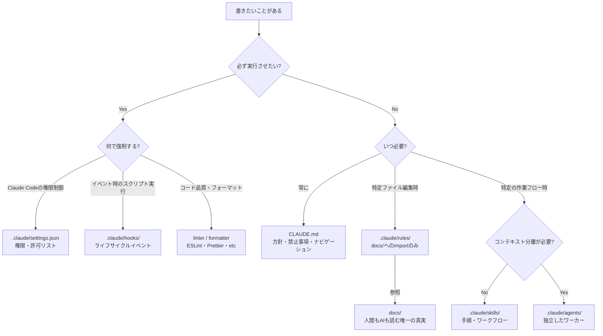
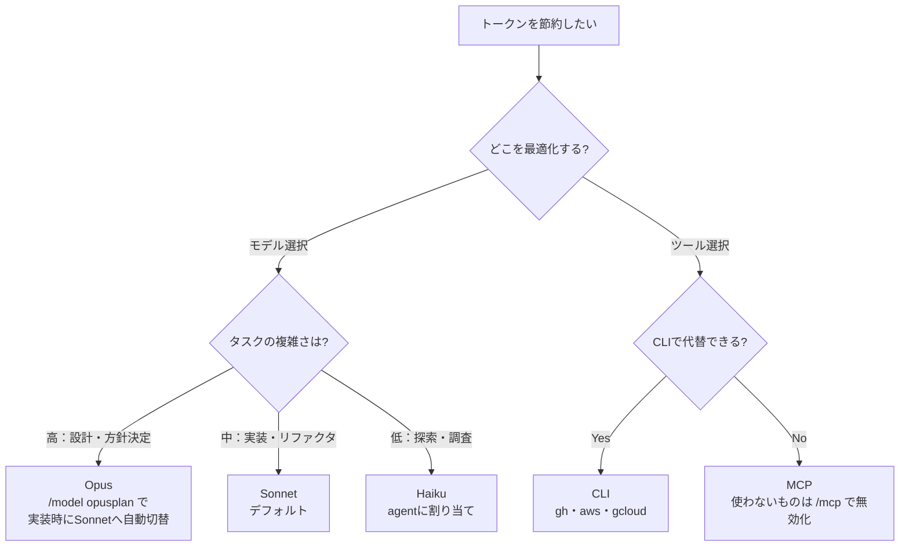

# AI協業設計ガイド

Claude Codeの設定設計における原則と構成パターン。複数プロジェクトで共通して参照できる汎用ナレッジ。

---

## 設計原則

1. **コンテキストウィンドウが唯一の制約** — CLAUDE.mdは長いほど守られなくなる（目安200行以内）
2. **具体性が信頼性を決める** — 検証可能な形で書けないルールは書かない
3. **強制と指針を分ける** — 必ず守らせたいことはhooks/settingsへ。CLAUDE.mdは保証されない
4. **遅延ロードで設計する** — 常に必要なものだけ起動時に読み込む
5. **構造がコンテンツと同じくらい重要** — 長くなったらまず削る

---

## 何をどこに書くか



### rules はアダプター層

`docs/` の内容をコピーせず、パスだけ持つ。二重管理を避ける。

```markdown
---
paths:
  - "src/**/*.ts"
---
@docs/CODING_GUIDELINES.md
```

---

## モデルとトークンの最適化



---

## アンチパターン

- **手順をCLAUDE.mdに書く** → skillsへ
- **docs/の内容をrulesにコピーする** → importだけにする
- **何でもCLAUDE.mdに書く** → 長くなるほど重要なルールが無視される
- **検証できないルールを書く** → 「良いコードを書く」は機能しない

---

## 参考

- [Claude Code ドキュメント](https://docs.anthropic.com/ja/docs/claude-code)
