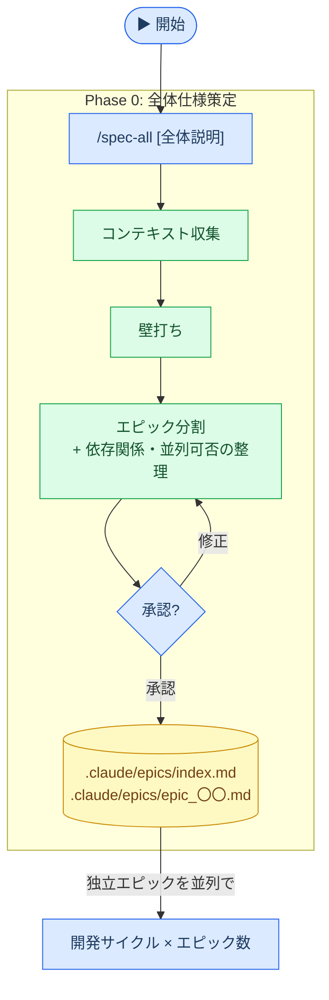

# 開発サイクル

## 並列開発サイクル（任意）

複数エピックを並列で進める場合は、開発サイクルの前に Phase 0 を実施する。

```mermaid
flowchart TD
    classDef ai fill:#dcfce7,stroke:#16a34a,color:#14532d
    classDef human fill:#dbeafe,stroke:#2563eb,color:#1e3a5f
    classDef artifact fill:#fef9c3,stroke:#ca8a04,color:#713f12

    Start(["▶ 開始"]):::human

    subgraph Global["Phase 0: 全体仕様策定"]
        GlobalInvoke["/spec-all [全体説明]"]:::human
        GlobalCtx["コンテキスト収集"]:::ai
        GlobalDiscuss["壁打ち"]:::ai
        GlobalEpics["エピック分割\n+ 依存関係・並列可否の整理"]:::ai
        GlobalApprove{"承認?"}:::human
        GlobalDoc[(".claude/epics/index.md\n.claude/epics/epic_〇〇.md")]:::artifact
        GlobalInvoke --> GlobalCtx --> GlobalDiscuss --> GlobalEpics --> GlobalApprove
        GlobalApprove -- 修正 --> GlobalEpics
        GlobalApprove -- 承認 --> GlobalDoc
    end

    Start --> GlobalInvoke
    GlobalDoc -->|独立エピックを並列で| ExistingCycle["開発サイクル × エピック数"]:::human
```

## 開発サイクル

```mermaid
flowchart TD
    classDef ai fill:#dcfce7,stroke:#16a34a,color:#14532d
    classDef human fill:#dbeafe,stroke:#2563eb,color:#1e3a5f
    classDef artifact fill:#fef9c3,stroke:#ca8a04,color:#713f12

    Start(["▶ 開始"]):::human
    NeedSpec{"仕様策定が必要?"}:::human
    Start --> NeedSpec

    subgraph Spec["Phase 1: 仕様策定（任意）"]
        SpecInvoke["/spec [機能説明 or 既存仕様ファイルパス]"]:::human
        SpecCtx["Step1: コンテキストの収集"]:::ai
        SpecDiscuss["Step2: 壁打ち"]:::ai
        SpecStories["Step3: ストーリー分割"]:::ai
        SpecSave["Step4: 仕様書の作成"]:::ai
        SpecReview["Step5: 仕様レビュー・修正"]:::ai
        SpecApprove{"Step6: 承認?"}:::human
        SpecDoc[(".claude/temp/specs/機能名.md")]:::artifact
        SpecInvoke --> SpecCtx --> SpecDiscuss --> SpecStories --> SpecSave --> SpecReview --> SpecApprove
        SpecApprove -- 修正 --> SpecSave
        SpecApprove -- 承認 --> SpecDoc
    end

    subgraph Design["Phase 1.5: 詳細設計（任意）"]
        DesignInvoke["/design [.claude/temp/specs/機能名.md or 設計対象の説明]"]:::ai
        DesignCtx["Step1: コンテキストの収集"]:::ai
        DesignCreate["Step2: 技術設計"]:::ai
        DesignReview["Step3: 設計レビュー・修正"]:::ai
        DesignApprove{"Step4: 承認?"}:::human
        DesignDoc[(".claude/temp/designs/機能名.md")]:::artifact
        DesignInvoke --> DesignCtx --> DesignCreate --> DesignReview --> DesignApprove
        DesignApprove -- 修正 --> DesignCreate
        DesignApprove -- 承認 --> DesignDoc
    end

    subgraph Build["Phase 2: 実装"]
        BuildInvoke["/build [.claude/temp/specs/機能名.md - 実装対象<br/>or リファクタ・バグ修正の説明]"]:::ai
        BuildCtx["Step1: コンテキストの収集"]:::ai
        BuildPlan["Step2: 実装方針の作成"]:::ai
        BuildPlanReview["Step3: 実装方針レビュー・修正"]:::ai
        BuildApprove{"Step4: 承認?"}:::human
        BuildPlanDoc[(".claude/temp/plans/機能名.md")]:::artifact
        BuildImpl["Step5: 実装"]:::ai
        BuildReview["Step6: コードレビュー・修正"]:::ai
        BuildFeedback{"Step7: 承認?"}:::human
        BuildPR["Step8: PR作成"]:::ai
        BuildPRDoc[("PR")]:::artifact
        BuildInvoke --> BuildCtx --> BuildPlan --> BuildPlanReview --> BuildApprove
        BuildApprove -- 修正 --> BuildPlan
        BuildApprove -- 承認 --> BuildPlanDoc --> BuildImpl --> BuildReview --> BuildFeedback
        BuildFeedback -- 修正 --> BuildImpl
        BuildFeedback -- 承認 --> BuildPR --> BuildPRDoc
    end

    NeedSpec -- Yes --> SpecInvoke
    NeedSpec -- No --> NeedDesign
    SpecDoc --> NeedDesign{"詳細設計が必要?"}:::human
    NeedDesign -- Yes --> DesignInvoke
    NeedDesign -- No --> BuildInvoke
    DesignDoc --> BuildInvoke
    BuildPRDoc --> End(["完了"]):::human
```
